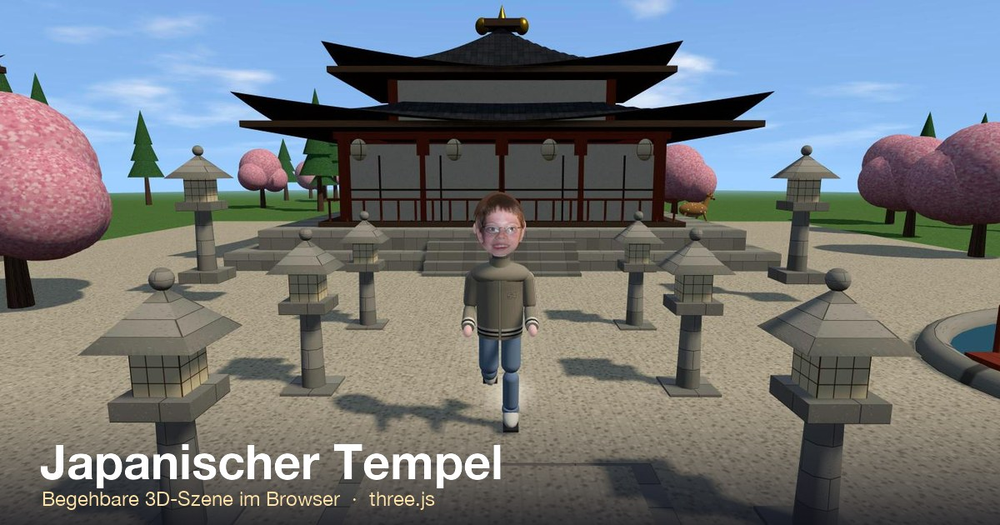

# Japanischer Tempel – 3D

[Deutsch](#japanischer-tempel--3d) · [English](#japanese-temple--3d) · [Italiano](#tempio-giapponese--3d) · [日本語](#日本の寺--3d)

[](https://helmutqualtinger.github.io/japan-tempel/)

Eine navigierbare 3D-Szene eines japanischen Tempels im Browser, gebaut mit [three.js](https://threejs.org/). Alles steckt in einer einzigen Datei: `tempel.html`.

## Starten

Die Seite lädt three.js per CDN (jsdelivr) und braucht deshalb beim ersten Aufruf Internet; danach hält ein Service Worker (`sw.js`) alles im Cache, und die Szene läuft auch offline. Sie muss über HTTP ausgeliefert werden, nicht per `file://`.

```bash
python3 -m http.server 8757
```

Danach im Browser öffnen: <http://localhost:8757/tempel.html>

### Als App auf Android oder iOS installieren

Die Szene ist eine installierbare Web-App (PWA). <https://helmutqualtinger.github.io/japan-tempel/> in Chrome öffnen, dann im Menü (⋮) **App installieren** bzw. **Zum Startbildschirm hinzufügen** wählen. Auf iPhone/iPad die Seite in Safari öffnen, auf **Teilen** tippen und **Zum Home-Bildschirm** wählen. Sie startet danach im Vollbild mit eigenem Icon und funktioniert offline.

## Bedienung

| Aktion | Wirkung |
|---|---|
| Maus ziehen | Ansicht drehen |
| Mausrad | Zoomen |
| Rechtsklick oder Shift + Ziehen | Ansicht verschieben |
| Button **Regen** | Regen ein/aus |
| Button **Tag / Nacht** | Zwischen Tag und Nacht überblenden |
| Button **Auto-Rotation** | Kamera kreist automatisch |

## Was in der Szene steckt

- **Haupthalle** mit Steinsockel, Treppe, roten Holzpfeilern, Shoji-Türen, Veranda und zweistöckigem, geschwungenem Dach
- **Tokyo Tower** (anstelle der früheren Pagode)
- **Burg Ōsaka** als verkleinertes Modell rechts neben der Halle
- **Zwei Torii-Tore** und ein Pfad mit Steinlaternen
- **Teich** mit Holzbrücke; Wellen und Regenringe rechnet ein Fragment-Shader
- **Kiefern und Kirschbäume**
- **Drei Damhirsche und eine Giraffe**, die auf festen Wegen durch die Szene laufen
- **Regen**, der Himmel, Licht und Nebel abdunkelt (Tropfen komplett im Vertex-Shader animiert)
- **Nacht** mit leuchtenden Laternen

Alle Texturen (Stein, Holz, Ziegel, Gras, Rinde, Laub, Papier) werden beim Laden per Canvas-Code erzeugt. Es gibt keine Bilddateien.

## Technik

- three.js 0.160.0 mit `OrbitControls`, eingebunden über eine `importmap`
- Keine Build-Schritte, keine Abhängigkeiten zum Installieren
- Technische Hinweise zum Aufbau der Datei stehen in [CLAUDE.md](CLAUDE.md)

---

# Japanese Temple – 3D

A navigable 3D scene of a Japanese temple in the browser, built with [three.js](https://threejs.org/). Everything lives in a single file: `tempel.html`.

## Running

The page loads three.js from a CDN (jsdelivr), so it needs an internet connection on the first visit; after that a service worker (`sw.js`) keeps everything cached and the scene also runs offline. It must be served over HTTP, not opened via `file://`.

```bash
python3 -m http.server 8757
```

Then open in the browser: <http://localhost:8757/tempel.html>

### Installing as an app on Android or iOS

The scene is an installable web app (PWA). Open <https://helmutqualtinger.github.io/japan-tempel/> in Chrome, then choose **Install app** or **Add to Home screen** from the menu (⋮). On iPhone/iPad open the page in Safari, tap **Share** and choose **Add to Home Screen**. It then launches fullscreen with its own icon and works offline.

## Controls

The buttons in the scene are labelled in German.

| Action | Effect |
|---|---|
| Drag the mouse | Rotate the view |
| Mouse wheel | Zoom |
| Right-click or Shift + drag | Pan the view |
| Button **Regen** (rain) | Rain on/off |
| Button **Tag / Nacht** (day / night) | Fade between day and night |
| Button **Auto-Rotation** | Camera orbits automatically |

## What's in the scene

- **Main hall** with a stone plinth, steps, red wooden pillars, shoji doors, a veranda and a two-tier curved roof
- **Tokyo Tower** (in place of the former pagoda)
- **Osaka Castle** as a scaled-down model to the right of the hall
- **Two torii gates** and a path lined with stone lanterns
- **Pond** with a wooden bridge; waves and rain rings are computed by a fragment shader
- **Pines and cherry trees**
- **Three fallow deer and a giraffe** walking through the scene on fixed routes
- **Rain** that darkens the sky, light and fog (drops animated entirely in the vertex shader)
- **Night** with glowing lanterns

All textures (stone, wood, roof tiles, grass, bark, foliage, paper) are generated by canvas code at load time. There are no image files.

## Tech

- three.js 0.160.0 with `OrbitControls`, included via an `importmap`
- No build steps, no dependencies to install
- Technical notes on how the file is structured are in [CLAUDE.md](CLAUDE.md)

---

# Tempio giapponese – 3D

Una scena 3D navigabile di un tempio giapponese nel browser, realizzata con [three.js](https://threejs.org/). È tutto in un unico file: `tempel.html`.

## Avvio

La pagina carica three.js da una CDN (jsdelivr) e richiede quindi una connessione a Internet alla prima visita; in seguito un service worker (`sw.js`) tiene tutto in cache e la scena funziona anche offline. Deve essere servita via HTTP, non aperta tramite `file://`.

```bash
python3 -m http.server 8757
```

Poi aprire nel browser: <http://localhost:8757/tempel.html>

### Installare come app su Android o iOS

La scena è una web app installabile (PWA). Aprire <https://helmutqualtinger.github.io/japan-tempel/> in Chrome, poi scegliere **Installa app** o **Aggiungi a schermata Home** dal menu (⋮). Su iPhone/iPad aprire la pagina in Safari, toccare **Condividi** e scegliere **Aggiungi alla schermata Home**. Si avvia quindi a schermo intero con la propria icona e funziona offline.

## Comandi

I pulsanti nella scena hanno etichette in tedesco.

| Azione | Effetto |
|---|---|
| Trascinare il mouse | Ruotare la vista |
| Rotellina del mouse | Zoom |
| Clic destro o Shift + trascinamento | Spostare la vista |
| Pulsante **Regen** (pioggia) | Pioggia sì/no |
| Pulsante **Tag / Nacht** (giorno / notte) | Dissolvenza tra giorno e notte |
| Pulsante **Auto-Rotation** | La telecamera ruota automaticamente |

## Cosa c'è nella scena

- **Sala principale** con basamento in pietra, scalinata, pilastri di legno rossi, porte shoji, veranda e tetto curvo a due livelli
- **Tokyo Tower** (al posto della pagoda di prima)
- **Castello di Osaka** in scala ridotta, a destra della sala
- **Due portali torii** e un sentiero con lanterne di pietra
- **Stagno** con ponte di legno; onde e cerchi della pioggia sono calcolati da un fragment shader
- **Pini e ciliegi**
- **Tre daini e una giraffa** che attraversano la scena su percorsi fissi
- **Pioggia** che oscura cielo, luce e nebbia (gocce animate interamente nel vertex shader)
- **Notte** con lanterne accese

Tutte le texture (pietra, legno, tegole, erba, corteccia, fogliame, carta) vengono generate al caricamento con codice canvas. Non ci sono file immagine.

## Tecnica

- three.js 0.160.0 con `OrbitControls`, incluso tramite una `importmap`
- Nessun passaggio di build, nessuna dipendenza da installare
- Le note tecniche sulla struttura del file si trovano in [CLAUDE.md](CLAUDE.md)

---

# 日本の寺 – 3D

ブラウザで自由に見て回れる、日本の寺の3Dシーンです。[three.js](https://threejs.org/) で作られており、すべてが1つのファイル `tempel.html` に収まっています。

## 起動方法

three.js を CDN（jsdelivr）から読み込むため、初回のみインターネット接続が必要です。以降はサービスワーカー（`sw.js`）がすべてをキャッシュし、オフラインでも動作します。`file://` で直接開くのではなく、HTTP 経由で配信してください。

```bash
python3 -m http.server 8757
```

その後、ブラウザで開きます: <http://localhost:8757/tempel.html>

### Android・iOS にアプリとしてインストール

このシーンはインストール可能なウェブアプリ（PWA）です。Chrome で <https://helmutqualtinger.github.io/japan-tempel/> を開き、メニュー（⋮）から **アプリをインストール** または **ホーム画面に追加** を選びます。iPhone／iPad では Safari でページを開き、**共有** をタップして **ホーム画面に追加** を選びます。以降は専用アイコンから全画面で起動し、オフラインでも動作します。

## 操作方法

シーン内のボタンはドイツ語表記です。

| 操作 | 効果 |
|---|---|
| マウスをドラッグ | 視点を回転 |
| マウスホイール | ズーム |
| 右クリック、または Shift + ドラッグ | 視点を平行移動 |
| ボタン **Regen**（雨） | 雨のオン／オフ |
| ボタン **Tag / Nacht**（昼／夜） | 昼と夜をなめらかに切り替え |
| ボタン **Auto-Rotation**（自動回転） | カメラが自動で周回 |

## シーンの内容

- **本堂** — 石の基壇、階段、朱塗りの木の柱、障子、縁側、反りのある二重の屋根
- **東京タワー**（以前の五重塔の代わり）
- **大阪城** — 本堂の右隣にある縮小模型
- **二つの鳥居**と、石灯籠の並ぶ参道
- **池**と木の橋 — 波と雨の波紋はフラグメントシェーダーで計算
- **松と桜**
- **ダマジカ3頭とキリン1頭** — 決まった経路でシーン内を歩き回ります
- **雨** — 空・光・霧を暗くします（雨粒はすべて頂点シェーダーでアニメーション）
- **夜** — 灯籠に明かりがともります

テクスチャ（石、木、瓦、草、樹皮、葉、紙）はすべて、読み込み時に canvas のコードで生成されます。画像ファイルはありません。

## 技術

- three.js 0.160.0 と `OrbitControls`（`importmap` で読み込み）
- ビルド手順なし、インストールが必要な依存関係なし
- ファイル構成に関する技術的なメモは [CLAUDE.md](CLAUDE.md) にあります
